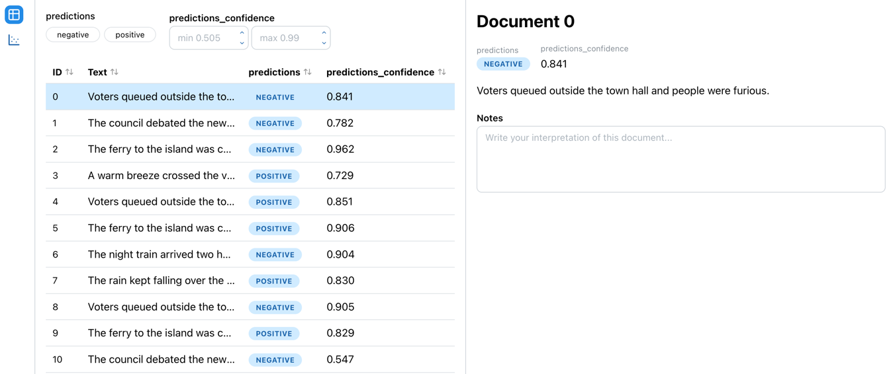

# sourcetext

[](https://pypi.org/project/sourcetext/)
[](https://github.com/KasperFyhn/sourcetext/actions/workflows/ci.yml)
[](https://github.com/KasperFyhn/sourcetext/blob/main/LICENSE)

**Return to the source text behind your model output, and write down what you find.**

Sometimes, working with and understanding a text corpus requires more than your NLP models' output. It requires close reading of the source text: looking at the documents behind a prediction, a cluster, or an
outlier score, and recording your interpretation as you go.

sourcetext gives you that in one line of Python. Hand it your texts and
your model's output (labels, scores, clusters, embeddings, dates), and it opens a
local web app where you can browse, sort, filter and plot the documents, read each
one in full, and attach notes to it.

```bash
pip install sourcetext
```

## Quickstart

```python
from sourcetext import SourceText

texts = [
    "The harvest failed for the third year running.",
    "A new bridge was opened to great celebration.",
    "Grain prices rose sharply in the spring.",
]
predictions = ["negative", "positive", "negative"]

st = SourceText(texts, predictions=predictions)
st.start_server()  # then open http://localhost:8001
```

And dive into the source text in a simple UI in your browser.



In a script, `start_server()` blocks until you press Ctrl+C. In Jupyter it runs in
the background, so you can keep working and call `st.stop_server()` when done.

## What you get

- **Table view.** Every document with its fields as columns. Sort by any column,
  and filter by label, group, score range or date range.
- **Scatter view.** Plot documents by a 2D embedding projection (e.g. UMAP), or by
  any two scores against each other, optionally coloured by group. Useful for
  spotting where a model's confidence and a second measure disagree.
- **Document pane.** Select a document in either view to read its full text
  alongside all of its field values.
- **Notes.** Write a free-text note on any document while you read it.

## Examples

### Classification with gold labels and confidence

```python
from transformers import pipeline
from sourcetext import SourceText

classify = pipeline("sentiment-analysis")
outputs = classify(texts)

st = SourceText(
    texts,
    predictions=[o["label"] for o in outputs],
    predictions_confidence=[o["score"] for o in outputs],
    gold_labels=gold_labels,
)
st.start_server()
```

Sort by confidence to read the model's most and least certain calls, or filter to
documents where `predictions` and `gold_labels` disagree.

### Topic model with group definitions

```python
from bertopic import BERTopic
from sourcetext import ScoreType, SourceText

topic_model = BERTopic()
topics, probs = topic_model.fit_transform(texts)
keywords = {t: ", ".join(w for w, _ in topic_model.get_topic(t)) for t in set(topics)}

st = SourceText(
    texts,
    groups=topics,
    group_definitions=keywords,
    topic_probability=ScoreType(probs),
)
st.start_server()
```

Filter to one topic and sort by `topic_probability` to see its most and least typical
documents.

### Document embeddings on a map

```python
from sentence_transformers import SentenceTransformer
from sklearn.cluster import KMeans
from umap import UMAP
from sourcetext import SourceText, Point2DType

embeddings = SentenceTransformer("all-MiniLM-L6-v2").encode(texts)
clusters = KMeans(n_clusters=8).fit_predict(embeddings)
xy = UMAP().fit_transform(embeddings)

st = SourceText(
    texts,
    groups=clusters,
    embedding=Point2DType(xy),
)
st.start_server()
```

In the scatter view, pick `embedding` and colour by `groups` to see which clusters
the projection keeps together, then click through the points where it doesn't.

### From a DataFrame, with metadata

```python
from sourcetext import SourceText, TemporalType, TextType

# df has columns: id, text, title, year, prediction, gold
st = SourceText(
    data=df,
    texts="text",
    ids="id",
    predictions="prediction",
    gold_labels="gold",
    title=TextType("title"),
    year=TemporalType("year"),
)
st.start_server()
```

## Project status

sourcetext is in early development (alpha). The API may change between releases,
and some parts are not built yet:

- **Notes are not saved yet.** They live in an in-memory database and are lost
  when your Python process ends. Persisting them to a file next to your data is
  planned.
- **Spans** (`SpanType`, e.g. NER output) are accepted and stored, but not yet
  highlighted in the text.
- **Group definitions** are accepted and stored, but not yet shown in the app.

Feedback and issues are very welcome at
[github.com/KasperFyhn/sourcetext/issues](https://github.com/KasperFyhn/sourcetext/issues).

---

# Documentation

## `SourceText`

```python
SourceText(
    texts,
    *,
    data=None,
    ids=None,
    predictions=None,
    predictions_confidence=None,
    gold_labels=None,
    scores=None,
    groups=None,
    group_definitions=None,
    **fields,
)
```

`texts` is the only required argument. Everything else attaches a **field** to the
documents: one value per document, shown as a column in the table and as a row in
the document pane.

### Two ways to pass data

Every argument takes either **an array of values** (one per text, in the same
order: a list, numpy array or pandas Series), or, when `data=` is given, **the name
of a column** in that DataFrame. Pick one mode per call:

```python
# Lists
SourceText(texts, predictions=preds)

# DataFrame columns
SourceText(data=df, texts="text", predictions="pred")
```

Missing values can be given as `None`, and pandas' `NaN`/`NaT`/`pd.NA` are treated
the same way. Numpy and pandas values (e.g. `np.float32` scores, `np.datetime64`
dates) are converted to their plain Python equivalents.

### Document IDs

By default documents are numbered `0, 1, 2, …`. Pass `ids=` (ints or strings) to
use your own, e.g. to match document IDs elsewhere in your pipeline.

### Named fields

These cover the common cases, and need no wrapping:

| Argument                 | Field type  | For                                             |
|--------------------------|-------------|-------------------------------------------------|
| `predictions`            | `LabelType` | a classifier's predicted labels                 |
| `predictions_confidence` | `ScoreType` | the classifier's confidence in each prediction  |
| `gold_labels`            | `LabelType` | reference / ground-truth labels                 |
| `scores`                 | `ScoreType` | any single numeric score, e.g. sentiment        |
| `groups`                 | `GroupType` | cluster or topic assignments                    |
| `group_definitions`      | —           | descriptions of each group (see below)          |

### Custom fields

Any other keyword argument adds a field with that name. Wrap its values (or its
column name) in a field type, so sourcetext knows how to store, display and filter
it:

```python
from sourcetext import ScoreType, LabelType

SourceText(
    texts,
    toxicity=ScoreType(toxicity_scores),
    genre=LabelType("genre"),  # column name, with data=
)
```

## Field types

| Type           | Values                                              | In the app                                  | Typical use                         |
|----------------|-----------------------------------------------------|---------------------------------------------|-------------------------------------|
| `TextType`     | `str`                                               | shown as text                               | titles, authors, source metadata    |
| `LabelType`    | `str`, `int`, `bool`                                | badge; filter by value                      | classifier output, gold labels      |
| `ScoreType`    | `float`, `int`                                      | filter by range; scatter-plot axis          | confidence, sentiment, any metric   |
| `GroupType`    | `str`, `int`                                        | badge; filter by value; colour scatter plot | clusters, topics                    |
| `TemporalType` | `int` (a year), `datetime.date`, `datetime.datetime` | filter by range                             | publication year, timestamps        |
| `Point2DType`  | `(x, y)` pair of numbers                            | position in the scatter plot                | UMAP / t-SNE embedding projections  |
| `SpanType`     | list of `{"start", "end", "label"}` dicts           | *not yet displayed*                         | named entities, marked passages     |

All columns in the table view are sortable.

Notes on specific types:

- **`TemporalType`**: all values in one field must share a type. Plain ints are
  treated as years.
- **`SpanType`**: each document gets a list of spans (possibly empty). `start` and
  `end` are character offsets into the text, `label` is a string, and an optional
  `score` may be included.
- **`Point2DType`**: to plot two separate scores against each other instead, just
  pass them as two `ScoreType` fields and pick both as axes in the scatter view.

### Group definitions

`GroupType` accepts a `definitions=` dict mapping each group ID to a description.
That can be a plain string, or any JSON-serializable object (e.g. keywords with
weights). `group_definitions=` is shorthand for attaching one to `groups=`:

```python
# These are equivalent:
SourceText(texts, groups=topics, group_definitions=keywords)
SourceText(texts, groups=GroupType(topics, definitions=keywords))

# Custom group fields take definitions= directly:
SourceText(texts, era=GroupType(eras, definitions={"early": "before 1850", "late": "1850 and after"}))
```

## Serving the app

```python
st.start_server(port=8001, block=None)
st.stop_server()
```

- `port`: where the app is served, at `http://localhost:<port>`.
- `block`: `True` blocks until Ctrl+C (for scripts). `False` runs the server in
  the background (for Jupyter and other running event loops). The default `None`
  picks the right one automatically.

## Contributing

Development setup, the architecture, and how the Python package and the React
frontend fit together are described in
[CLAUDE.md](https://github.com/KasperFyhn/sourcetext/blob/main/CLAUDE.md). In short:

```bash
pip install -e ".[dev]"
pre-commit install
pytest
./scripts/dev.sh classification_simple   # API + hot-reloading UI on a mock dataset
```

## License

MIT
